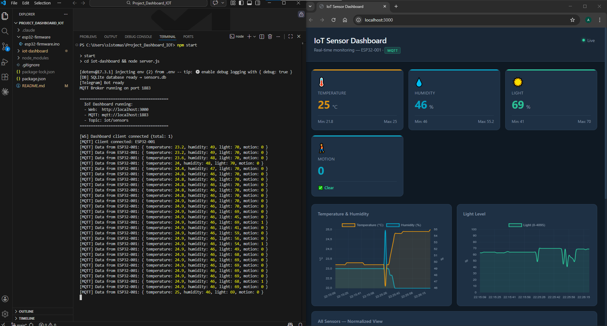
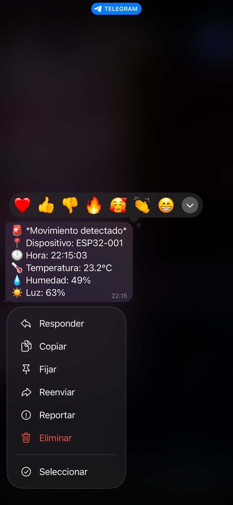
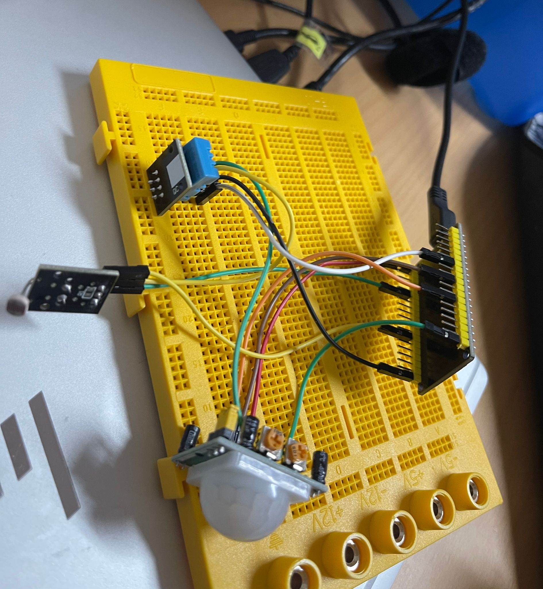
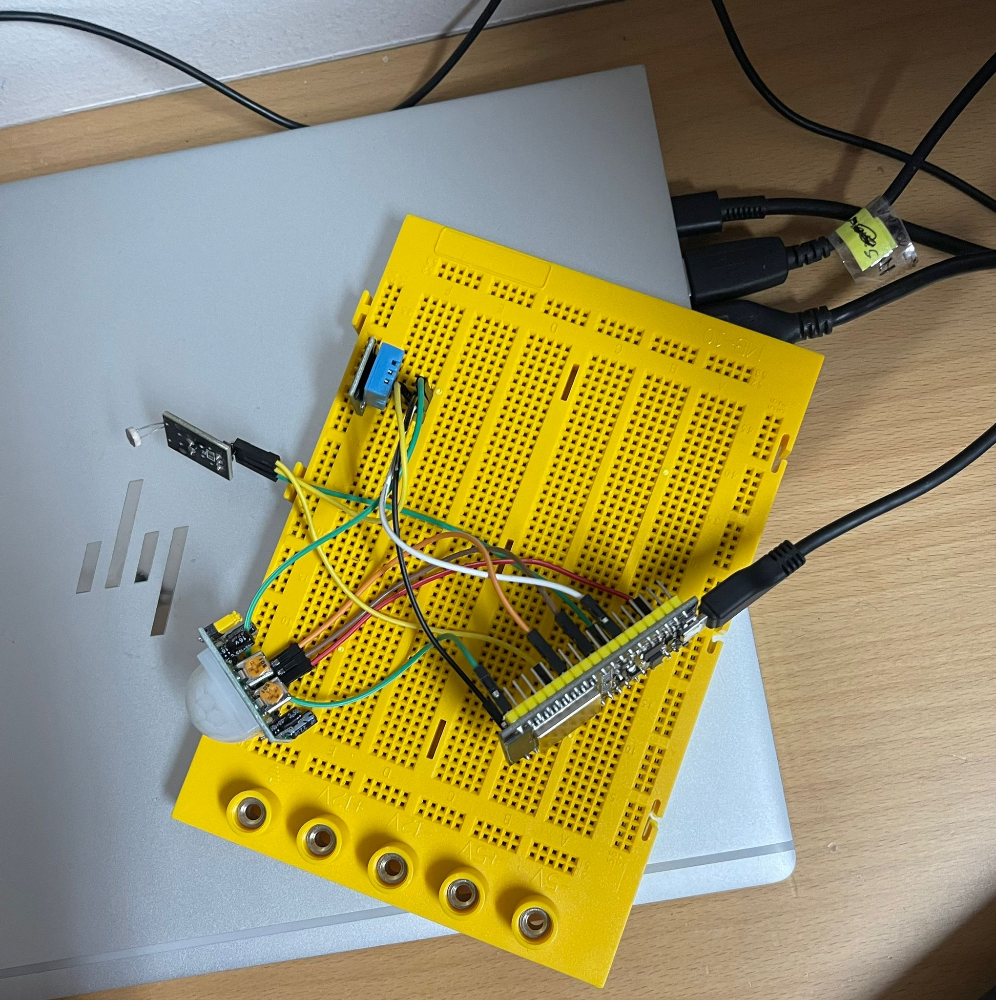

# 🏠 Home Security & Environment Monitor

> Real-time IoT home alarm system built with ESP32, MQTT, Node.js and a live web dashboard.


---

## What it does

This project turns an ESP32 microcontroller into a home security and environment monitoring system. It detects motion, measures temperature, humidity and light levels — all displayed on a real-time web dashboard. When motion is detected, an instant Telegram alert is sent to your phone.

---

## System Architecture

```
ESP32 (sensors)
     │
     │  WiFi + MQTT
     ▼
Node.js Server  ──── SQLite Database (historical data)
     │
     │  WebSocket
     ▼
Web Dashboard (real-time charts)
     │
     │  Telegram Bot API
     ▼
Phone notification
```

---

## Hardware

| Component                    | Purpose                     |
|------------------------------|-----------------------------|
| ESP32 WROOM-32 (AZ-Delivery) | Main microcontroller + WiFi |
| DHT11                        | Temperature & humidity      |
| PIR HC-SR501                 | Motion detection            | 
| LDR Photo-resistor           | Light level                 |

---

## Tech Stack

| Layer     | Technology              |
|-----------|-------------------------|
| Firmware  | C++ (Arduino IDE)       |
| Protocol  | MQTT (Aedes broker)     |
| Backend   | Node.js + Express       |
| Real-time | WebSocket               |
| Database  | SQLite (better-sqlite3) |
| Frontend  | HTML + CSS + Chart.js   |
| Alerts    | Telegram Bot API        |

---

## Features

- 📡 **Real-time data** — sensor readings every 2 seconds via MQTT
- 📊 **Live charts** — temperature, humidity and light history
- 🚨 **Motion alerts** — instant Telegram notification when motion is detected
- 💾 **Data persistence** — all readings saved to SQLite database
- 📱 **Responsive** — dashboard works on mobile and desktop

---

## Getting Started

### Requirements
- Node.js 18+
- Arduino IDE 2.x with ESP32 board support
- ESP32 + sensors (see hardware table above)

### Backend setup

```bash
cd iot-dashboard
npm install
npm start
```

The server runs on `http://localhost:3000`
MQTT broker on port `1883`

### Firmware setup

1. Open `esp32-firmware/esp32-firmware.ino` in Arduino IDE
2. Edit your credentials:
```cpp
const char* WIFI_SSID     = "YOUR_WIFI";
const char* WIFI_PASSWORD = "YOUR_PASSWORD";
const char* MQTT_SERVER   = "YOUR_PC_IP";
```
3. Select `Tools → Board → ESP32 Dev Module`
4. Upload to the ESP32

### Telegram alerts setup

1. Create a bot with [@BotFather](https://t.me/BotFather)
2. Get your Chat ID from `https://api.telegram.org/bot<TOKEN>/getUpdates`
3. Edit `server.js`:
```js
const TELEGRAM_TOKEN   = 'YOUR_BOT_TOKEN';
const TELEGRAM_CHAT_ID = 'YOUR_CHAT_ID';
```

---

## Screenshots

### Web Dashboard


### MQTT Terminal Output


### Telegram Motion Alert


### Hardware



---

## Dashboard

The web dashboard shows:
- **4 sensor cards** with current values and min/max
- **3 live charts** — Temperature & Humidity, Light Level, All Sensors Normalized
- **Alert log** — motion events with timestamp

---

## API Endpoints

| Endpoint           | Description                     |
|--------------------|---------------------------------|
| `GET /`            | Web dashboard                   |
| `GET /api/history` | Last 100 readings from database |
| `GET /api/status`  | Server status (MQTT, WebSocket) |

---

## Project Context

Built as part of a Telecommunications Engineering project to demonstrate a full IoT pipeline: from physical sensors to real-time cloud-ready monitoring with instant mobile notifications.

---

## License

MIT
